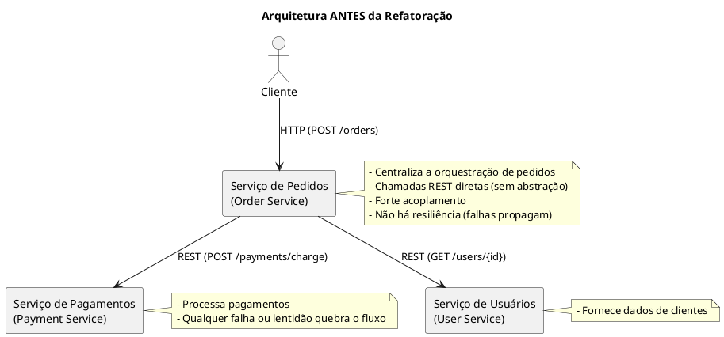
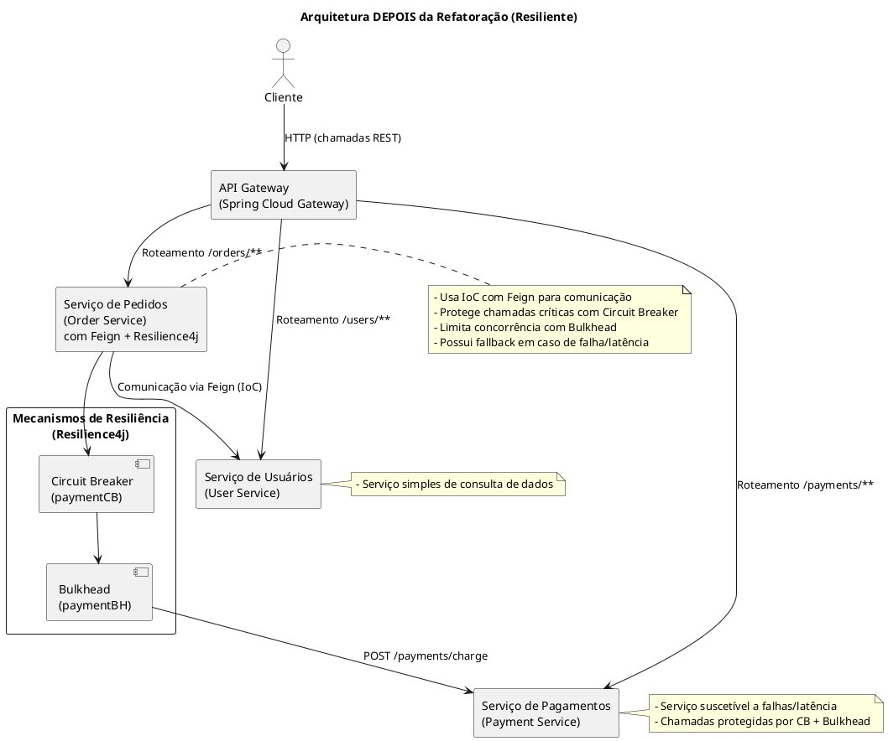

# Projeto de Microserviços com Pagamentos

Este repositório desenvolvido por Hildemar demonstra a evolução de um sistema baseado em microserviços, partindo de uma **versão inicial** (simples e acoplada) até chegar a uma **versão refatorada resiliente** (com padrões modernos de resiliência, desacoplamento e observabilidade). O projeto foi desenvolvido para fins acadêmicos, atendendo aos requisitos de análise de arquitetura, identificação de problemas, aplicação de padrões de projeto e documentação da solução.

---

##  Introdução do Projeto

O sistema é composto por três serviços principais:

- **User Service**: responsável pelo gerenciamento de usuários.  
- **Payment Service**: responsável pelas cobranças e pagamentos.  
- **Order Service**: responsável pela criação de pedidos, que dependem de informações do usuário e da confirmação de pagamento.  

O projeto foi implementado em três etapas:  
1. **Versão inicial**: implementação simples, sem resiliência, com comunicação direta entre serviços.   
2. **Versão refatorada resiliente**: aplicação de padrões modernos (API Gateway, OpenFeign, Circuit Breaker, Bulkhead e Actuator).  

---

##  O que contém no projeto

- **versao_inicial/**  
  Contém os três serviços básicos (User, Payment e Order), com chamadas REST diretas. Nesta versão, não existem mecanismos de resiliência e o Order Service está fortemente acoplado aos demais.

- **versao_refatorada_resiliente/**  
  Versão final e recomendada. Contém:
  - **API Gateway** para centralizar acessos.  
  - **OpenFeign (IoC)** para comunicação desacoplada entre serviços.  
  - **Circuit Breaker** (Resilience4j) para fallback em falhas de pagamento.  
  - **Bulkhead** (Resilience4j) para limitar concorrência.  
  - **Actuator** para expor métricas básicas.  

- **uml-antes.puml** e **uml-depois.puml**  
  Arquivos PlantUML que descrevem a arquitetura antes e depois da refatoração.
  

- **Relatorio.pdf**  
  Relatório técnico (mínimo 7 páginas) com análise da versão inicial, anti-patterns encontrados, refatorações propostas, comparação das arquiteturas e conclusões se encontra no email.

---

##  Estrutura do Projeto

- `versao_inicial/`
  - `user-service/`
  - `payment-service/`
  - `order-service/`
- `versao_refatorada_resiliente/`
  - (mesmos serviços, refatorados)
  - `api-gateway/`
  - `user-service/`
  - `payment-service/`
  - `order-service/`
- `uml-antes.puml`
- `uml-depois.puml`
- `README.md`

---

##  Execução da Versão Inicial

A versão inicial não utiliza API Gateway. Cada serviço roda de forma independente.

A versão inicial não utiliza **API Gateway**. Cada serviço roda de forma independente, e o **Order Service** chama diretamente os outros dois.

* **Passo 1 — Iniciar o User Service**  
  `cd versao_inicial/user-service && mvn spring-boot:run`

* **Passo 2 — Iniciar o Payment Service**  
  `cd versao_inicial/payment-service && mvn spring-boot:run`

* **Passo 3 — Iniciar o Order Service**  
  `cd versao_inicial/order-service && mvn spring-boot:run`

* **Teste 1 — Consultar usuário**  
  `curl "http://localhost:<PORTA_USER>/users/1"`

* **Teste 2 — Realizar cobrança direta no Payment**  
  `curl -X POST "http://localhost:<PORTA_PAYMENT>/payments/charge" -H "Content-Type: application/json" -d "{\"userId\":1,\"amount\":149.9}"`

* **Teste 3 — Criar pedido (Order chama User e Payment diretamente)**  
  `curl -X POST "http://localhost:<PORTA_ORDER>/orders?userId=1&amount=149.9"`

---

>  **Problemas esperados nesta versão:**  
> * Forte acoplamento entre serviços.  
> * Ausência de fallback ou timeout.  
> * Propagação de falhas do Payment.  
> * Violações de SOLID e anti-patterns como *God Service* e *Spaghetti Integration*.

##  Execução da Versão Refatorada Resiliente

Na versão refatorada resiliente, todo o tráfego passa pelo **API Gateway**. O **Order Service** utiliza **OpenFeign (IoC)** para comunicação com os outros serviços e conta com **Resilience4j** (Circuit Breaker + Bulkhead) para aumentar a tolerância a falhas.

* **Passo 1 — Iniciar o API Gateway**  
  `cd versao_refatorada_resiliente/api-gateway && mvn spring-boot:run`

* **Passo 2 — Iniciar o User Service**  
  `cd versao_refatorada_resiliente/user-service && mvn spring-boot:run`

* **Passo 3 — Iniciar o Payment Service**  
  `cd versao_refatorada_resiliente/payment-service && mvn spring-boot:run`

* **Passo 4 — Iniciar o Order Service**  
  `cd versao_refatorada_resiliente/order-service && mvn spring-boot:run`

* **Teste 1 — Criar pedido (via Gateway, com Circuit Breaker e Bulkhead atuando se houver falhas/latência)**  
  `curl -X POST "http://localhost:8080/orders?userId=1&amount=149.9"`

* **Teste 2 — Consultar usuário (via Gateway)**  
  `curl "http://localhost:8080/users/1"`

* **Teste 3 — Realizar cobrança direta (Payment simula falhas/latência)**  
  `curl -X POST "http://localhost:8080/payments/charge" -H "Content-Type: application/json" -d "{\"userId\":1,\"amount\":149.9}"`

---

 **Comportamento esperado nesta versão:**  
> * Se o Payment falhar, o **Circuit Breaker** abre e o **Order Service** retorna um fallback (`PENDING_PAYMENT`).  
> * O **Bulkhead** limita concorrência, evitando sobrecarga no Payment.  
> * O **API Gateway** centraliza o tráfego e facilita o consumo pelos clientes.  

## Pré-requisitos

- Java 17+  
- Maven 3.9+  
- cURL (para testes via linha de comando)  

---

## Visão Geral da Arquitetura

### Arquitetura Antes (Versão Inicial)

### Arquitetura Depois (Versão Resiliente)

---

## O que Foi Implementado

- **API Gateway** (Spring Cloud Gateway)  
- **IoC/Desacoplamento** com **OpenFeign** nos clients do `order-service`  
- **Circuit Breaker** (Resilience4j) com fallback configurado  
- **Bulkhead** (Resilience4j) para isolamento de concorrência  
- **Actuator** exposto para diagnóstico básico  
- **Diagramas UML (antes e depois da refatoração)** em PlantUML  
- **Relatório técnico** em PDF com diagnóstico, refatorações e conclusões  

---

## Conclusão

- A **versão inicial** mostra claramente os problemas de acoplamento e ausência de resiliência em uma arquitetura de microserviços.  
- A **versão resiliente** aplicou os padrões exigidos (API Gateway, OpenFeign, Circuit Breaker, Bulkhead e Actuator), tornando o sistema tolerante a falhas, mais organizado e aderente a boas práticas de arquitetura. 

